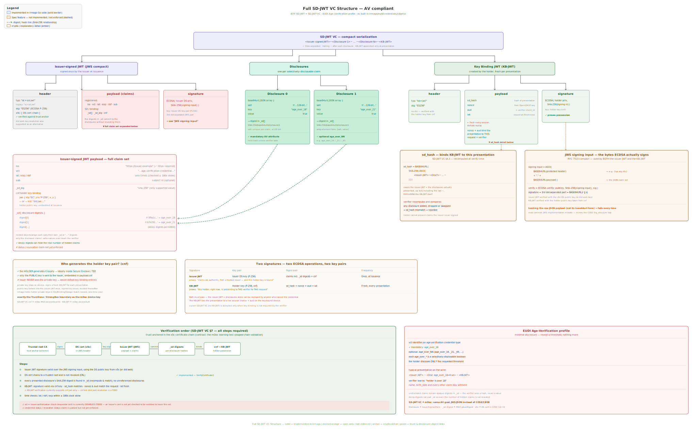

# SD-JWT VC structure (AV compliant)

The diagram below shows the full structure of an SD-JWT VC as implemented in
[`eudi/credentials/sdjwtvc`](../eudi/credentials/sdjwtvc), profiled against the
EUDI Age-Verification use case (`age_over_18` / `age_over_NN`).

It is the SD-JWT VC counterpart to the ISO 18013-5 mDoc diagram
(`testdata/mdoc/mdoc_full_spec.svg`) and uses the same visual language:

- **solid border** — implemented in irmago Go code
- **dashed orange** — spec feature that is not implemented or not yet enforced
- **green dashed arrow** — digest / hash link (SHA-256 relationship)
- **amber** — crypto / explanatory detail

## What it covers

- **Compact serialization** — `<Issuer-signed JWT>~<Disclosure 1>~ … ~<Disclosure N>~<KB-JWT>`
- **Issuer-signed JWT** (JWS) — header (`typ: dc+sd-jwt`, `alg: ES256`, `x5c`),
  the full claim set (`iss`, `vct`, `iat`/`exp`/`nbf`, `sub`, `cnf`, `_sd_alg`,
  `_sd`), and the signature.
- **Disclosures** — the `base64url([salt, key, value])` blobs whose SHA-256
  digests appear in `_sd`.
- **Key Binding JWT** (`kb+jwt`) — `sd_hash`, `nonce`, `aud`, `iat`, signed with
  the holder key referenced by `cnf`.
- **Two signatures** — the issuer signature (once, at issuance) and the KB-JWT
  signature (fresh, every presentation), analogous to the mDoc `issuerAuth` /
  `deviceAuth` pair.
- **Verification order** (SD-JWT VC §7) and the **EUDI Age-Verification profile**.

## Known gaps (as marked in the diagram)

- The `vct` ↔ issuer-authorization check against the requestor certificate is
  currently disabled (TODO).
- KB-JWT verification supports `cnf.jwk` only; `cnf.kid` (`did:jwk`) resolution
  is a TODO.
- Credential `status` / revocation is not yet enforced.
